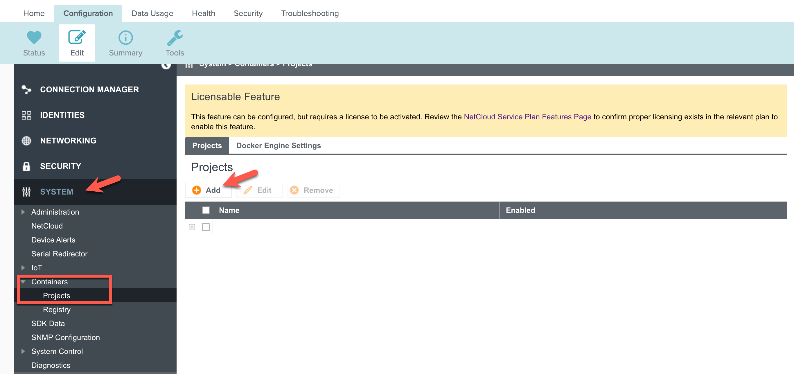

<p align="left">
  
</p>

# Ericom/Cradlepoint ZTEdge Connector
Ericom ZTEdge Connector in a docker container
zte-client has been integrated into docker environment to allow for easy deployments in Cradlepoint routers. 

*Notes: Not all Cradlepoint models support docker containers. Please refer to specific router documentation to determine if it is compatible with the current project.

The **zte-client** can be used as a client or as a connector. Cradlepoint routers use connector mode.

To pull the container:

```bash
docker pull sstarzh/zte-connector:alpine.latest
```

Running in the connector mode:

```bash
docker run -ti --cap-add=NET_ADMIN --sysctl="net.ipv4.ip_forward=1" -p 51821:51821 sstarzh/zte-connector:alpine.latest <tenant name> <connector name> <key> --connector [--debug]
```

Running in the client mode:

```bash
docker run -ti --cap-add=NET_ADMIN --sysctl="net.ipv4.ip_forward=1" sstarzh/zte-connector:alpine.latest <tenant name> <user> <password> [--debug]
```
<p align="left">
  
</p>

## Deploying in Cradlepoint router

### Login to NetCloud Manager and select Configuration -> Edit

1. Under the *Edit* tab navigate to **SYSTEM** -> **Containers** -> **Projects**

<p align="center">
  
</p>

2. Click **Add**
3. In the *Project Config* window type the desired name and ensure **Enabled** box is checked. Then click **Compose**

<p align="center">
  
</p>

4. Copy the content of the [[cradlepoint-container.yml]](https://github.com/sstarzh/zte-connector/blob/main/cradlepoint-container.yml) and paste in the opened window. Then click on **Compose Builder**

<p align="center">
  
</p>

5. The name of the service under **Services** menu will be pre-populated. Click on *Add* under **Networks** tab and select **Primary LAN** from the list. Then click **Save** in the pop-up window and click **Save** on the bottom of the wizard window.

<p align="center">
  
</p>

6. **Compose** tab will open automatically. Review the *Network* section which will be pre-populated. Then click **Save** on the bottom

<p align="center">
  
</p>

7. Project will be added to the list. Click **Commit** on the bottom to push the config to the device

<p align="center">
  
</p>

## Health check

**ztedge-client** supports HTTP health checks. The following parameters are configurable:

```bash
    --health-check-port <port>              health check port (0 for none) (default: 0)
    --health-check-path <path>              health check path (default: "/health")
    --health-check-timeout <sec>            how long the connection should be down (sec) for health check failure (default: 60)
```

By default this container exposes port 51821/tcp and uses `/health` path. 